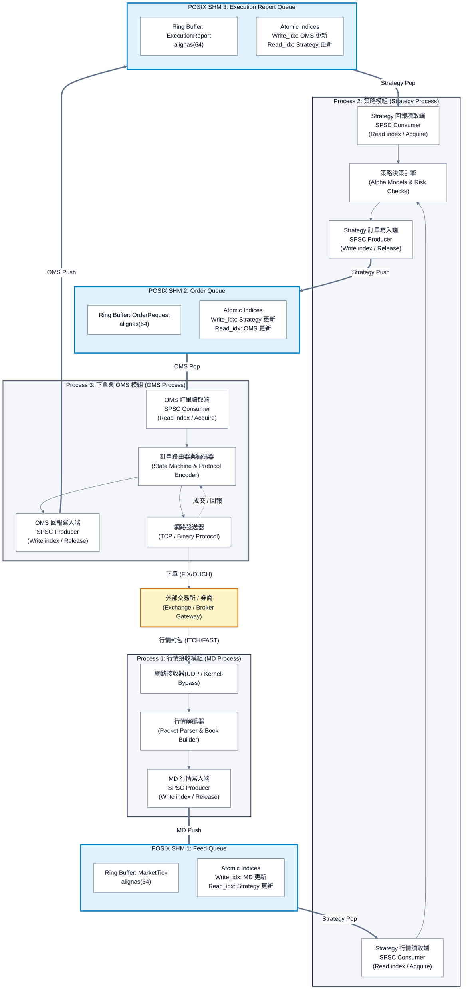

# 三大模組
* Process 1: **MD** 行情接收模組 (Market Data Process)
* Process 2: **ST** 策略模組 (Strategy Process)
* Process 3: **OMS** 下單與 OMS 模組 (Order Management System Process)

# 模組間通訊
維護三大模組間的通訊，使用 POSIX 共享記憶體 (POSIX Shared Memory) 與 SPSC (Single Producer Single Consumer) 無鎖佇列 (Lock-Free Queue) 進行資料交換。每個模組皆為獨立的 POSIX Process，並透過共享記憶體進行資料傳遞。

* POSIX SHM 1: Feed Queue
  * 用於 **MD** 與 **ST** 間的行情資料傳遞。
  * 資料型態: MarketTick
  * 記憶體對齊: alignas(64)
  * 原子索引:
    * Write_idx: MD 更新
    * Read_idx: ST 更新

* POSIX SHM 2: Order Queue
  * 用於 **ST** 與 **OMS** 間的訂單資料傳遞。
  * 資料型態: OrderRequest
  * 記憶體對齊: alignas(64)
  * 原子索引:
    * Write_idx: ST 更新
    * Read_idx: OMS 更新

* POSIX SHM 3: Execution Report Queue
  * 用於 **OMS** 與 **ST** 間的成交回報資料傳遞。
  * 資料型態: ExecutionReport
  * 記憶體對齊: alignas(64)
  * 原子索引:
    * Write_idx: OMS 更新
    * Read_idx: ST 更新

# ASIC Diagram

# Basic Ideas
* IPC（跨行程通訊）
    * 圖中 MD、Strategy、OMS 之間透過 Push／Pop 交換資料的整段流程。
    * Process 之間本來可能需要 socket 通訊，這裡使用 POSIX SHM + SPSC Queue 達到 IPC 
* SHM（共享記憶體）
    * 圖中的三個 POSIX SHM 方框，是兩個行程共同存取的記憶體區域。
* SPSC Queue（單生產者、單消費者佇列）
    * 放在每個 SHM 裡面的 Ring Buffer + Atomic Write_idx / Read_idx，負責管理資料的寫入與讀取。
    * 環狀緩衝區 (Ring Buffer) 
